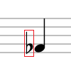
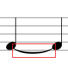

標籤
===
* [音符參考 wiki](https://en.wikipedia.org/wiki/List_of_musical_symbols#Time_signatures)

|     | Label              | picture                                        |
| --- | ------------------ | ---------------------------------------------- |
| 0   | brace              |                              |
| 1   | repeatLeft         |                            |
| 2   | repeatRight        |                            |
| 3   | segno              |                              |
| 4   | coda               |                               |
| 5   | gClef              |                              |
| 6   | cClef              |                              |
| 7   | fClef              |                              |
| 8   | bar                |                                |
| 9   | doubleBar          |                          |
| 10  | BoldDoubleBar      |                      |
| 11  | dotBar             |                             |
| 12  | timeSig44          |                           |
| 13  | timeSig22          |                           |
| 14  | timeSig0           | 0                                              |
| 15  | timeSig1           | 1                                              |
| 16  | timeSig2           | 2                                              |
| 17  | timeSig3           | 3                                              |
| 18  | timeSig4           | 4                                              |
| 19  | timeSig5           | 5                                              |
| 20  | timeSig6           | 6                                              |
| 21  | timeSig7           | 7                                              |
| 22  | timeSig8           | 8                                              |
| 23  | timeSig9           | 9                                              |
| 24  | octupleWholeNote   |                       |
| 25  | quadrupleWholeNote |                      |
| 26  | doubleWholeNote    |                    |
| 27  | wholeNote          |                          |
| 28  | halfNote           |                       |
| 29  | noteHead           |                           |
| 30  | flag8thSingleU     |                            |
| 31  | flag8thsingleD     |
| 32  | flag8thUp          |                           |
| 33  | flag8thDown        |
| 34  | flag16thSingleU    |                           |
| 35  | flag16thSingleD    |                          |
| 36  | flag16thUp         |
| 37  | flag16thDown       |
| 38  | flag32thSingleU    |                           |
| 39  | flag32thSingleD    |
| 40  | flag32thUp         |
| 41  | flag32thDown       |
| 42  | flag64thSingleU    |                           |
| 43  | flag64thSingleD    |
| 44  | flag64thUp         |
| 45  | flag64thDown       |
| 46  | flag128thSingleU   |                          |
| 47  | flag128thSingleD   |
| 48  | flag128thUp        |
| 49  | flag128thDown      |
| 50  | flag256thSingleU   |                          |
| 51  | flag256thSingleD   |
| 52  | flag256thUp        |
| 53  | flag256thDown      |
| 54  | octupleWholeRest   |                   |
| 55  | quadrupleWholeRest |                 |
| 56  | doubleWholeRest    |                    |
| 57  | wholeRest          |                           |
| 58  | halfRest           |                           |
| 59  | quarterRest0       |                       |
| 60  | quarterRest1       |                       |
| 61  | 8thRest            |                            |
| 62  | 16thRest           |                           |
| 63  | 32thRest           |                           |
| 64  | 64thRest           |                           |
| 65  | 128thRest          |                          |
| 66  | 256thRest          |                          |
| 67  | dot                |    |
| 68  | ghost              |                         |
| 69  | multiMeasureRest   |                        |
| 70  | breathMark         |                             |
| 71  | caesura            |                            |
| 72  | flat               |                               |
| 73  | sharp              |                              |
| 74  | natural            |                            |
| 75  | doubleSharp        |                        |
| 76  | demiflat           |                           |
| 77  | flatAndHalf        |                        |
| 78  | demisharp          |                          |
| 79  | sharpAndHalf       |                       |
| 80  | tie                |                                |
| 81  | slur               |                               |
| 82  | spiccato           |                           |
| 83  | tenuto             |                             |
| 84  | marcato            |                            |
| 85  | fermata            |                            |
| 86  | appoggiatura       |                       |
| 87  | acciaccatura       |                       |
| 88  | upBow              |                              |
| 89  | downBow            |                            |
| 90  | diminuendo         |   |
| 91  | crescendo          |                          |

